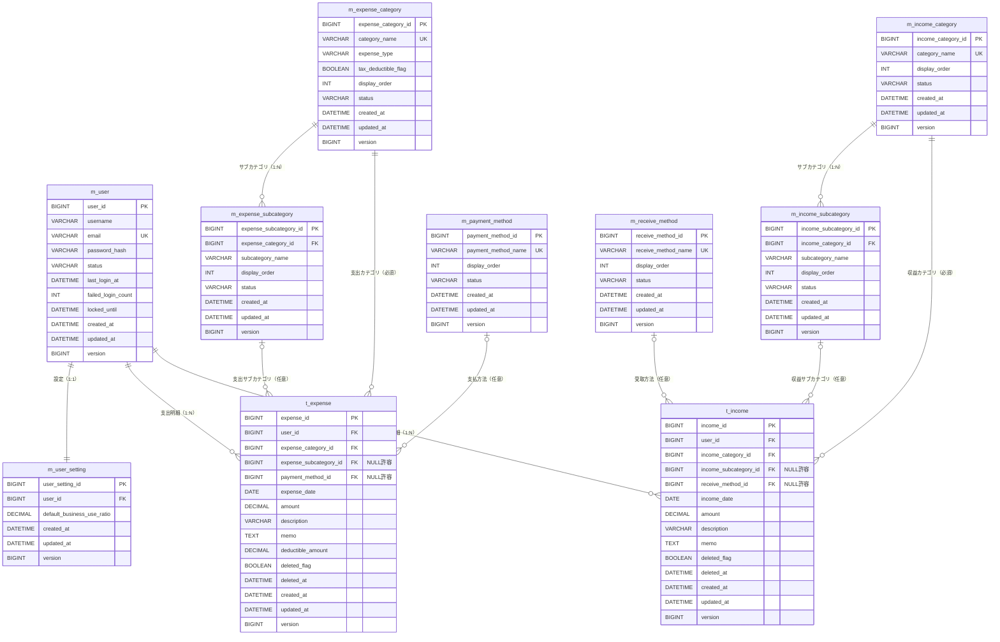

# ER図

```mermaid
erDiagram

    m_user {
        BIGINT      user_id             PK
        VARCHAR     username
        VARCHAR     email               UK
        VARCHAR     password_hash
        VARCHAR     status
        DATETIME    last_login_at
        INT         failed_login_count
        DATETIME    locked_until
        DATETIME    created_at
        DATETIME    updated_at
        BIGINT      version
    }

    m_user_setting {
        BIGINT      user_setting_id             PK
        BIGINT      user_id                     FK
        DECIMAL     default_business_use_ratio
        DATETIME    created_at
        DATETIME    updated_at
        BIGINT      version
    }

    m_expense_category {
        BIGINT      expense_category_id  PK
        VARCHAR     category_name        UK
        VARCHAR     expense_type
        BOOLEAN     tax_deductible_flag
        INT         display_order
        VARCHAR     status
        DATETIME    created_at
        DATETIME    updated_at
        BIGINT      version
    }

    m_expense_subcategory {
        BIGINT      expense_subcategory_id  PK
        BIGINT      expense_category_id     FK
        VARCHAR     subcategory_name
        INT         display_order
        VARCHAR     status
        DATETIME    created_at
        DATETIME    updated_at
        BIGINT      version
    }

    m_income_category {
        BIGINT      income_category_id  PK
        VARCHAR     category_name       UK
        INT         display_order
        VARCHAR     status
        DATETIME    created_at
        DATETIME    updated_at
        BIGINT      version
    }

    m_income_subcategory {
        BIGINT      income_subcategory_id  PK
        BIGINT      income_category_id     FK
        VARCHAR     subcategory_name
        INT         display_order
        VARCHAR     status
        DATETIME    created_at
        DATETIME    updated_at
        BIGINT      version
    }

    m_payment_method {
        BIGINT      payment_method_id    PK
        VARCHAR     payment_method_name  UK
        INT         display_order
        VARCHAR     status
        DATETIME    created_at
        DATETIME    updated_at
        BIGINT      version
    }

    m_receive_method {
        BIGINT      receive_method_id    PK
        VARCHAR     receive_method_name  UK
        INT         display_order
        VARCHAR     status
        DATETIME    created_at
        DATETIME    updated_at
        BIGINT      version
    }

    t_expense {
        BIGINT      expense_id              PK
        BIGINT      user_id                 FK
        BIGINT      expense_category_id     FK
        BIGINT      expense_subcategory_id  FK "NULL許容"
        BIGINT      payment_method_id       FK "NULL許容"
        DATE        expense_date
        DECIMAL     amount
        VARCHAR     description
        TEXT        memo
        DECIMAL     deductible_amount
        BOOLEAN     deleted_flag
        DATETIME    deleted_at
        DATETIME    created_at
        DATETIME    updated_at
        BIGINT      version
    }

    t_income {
        BIGINT      income_id              PK
        BIGINT      user_id                FK
        BIGINT      income_category_id     FK
        BIGINT      income_subcategory_id  FK "NULL許容"
        BIGINT      receive_method_id      FK "NULL許容"
        DATE        income_date
        DECIMAL     amount
        VARCHAR     description
        TEXT        memo
        BOOLEAN     deleted_flag
        DATETIME    deleted_at
        DATETIME    created_at
        DATETIME    updated_at
        BIGINT      version
    }

    m_user              ||--||   m_user_setting         : "設定（1:1）"
    m_user              ||--o{   t_expense              : "支出明細（1:N）"
    m_user              ||--o{   t_income               : "収益明細（1:N）"

    m_expense_category  ||--o{   m_expense_subcategory  : "サブカテゴリ（1:N）"
    m_expense_category  ||--o{   t_expense              : "支出カテゴリ（必須）"
    m_expense_subcategory |o--o{ t_expense              : "支出サブカテゴリ（任意）"

    m_income_category   ||--o{   m_income_subcategory   : "サブカテゴリ（1:N）"
    m_income_category   ||--o{   t_income               : "収益カテゴリ（必須）"
    m_income_subcategory |o--o{  t_income               : "収益サブカテゴリ（任意）"

    m_payment_method    |o--o{   t_expense              : "支払方法（任意）"
    m_receive_method    |o--o{   t_income               : "受取方法（任意）"
```

